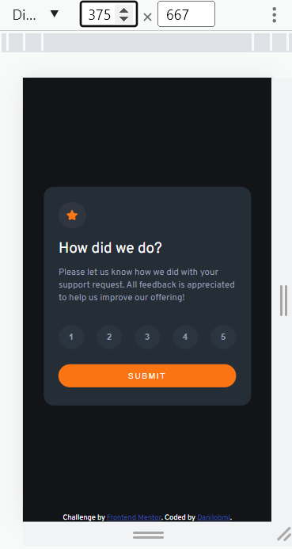
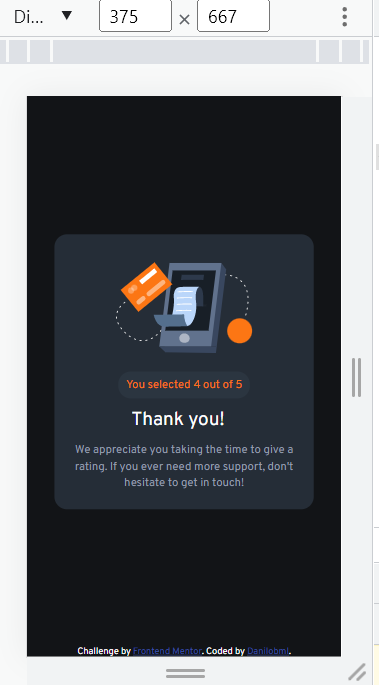
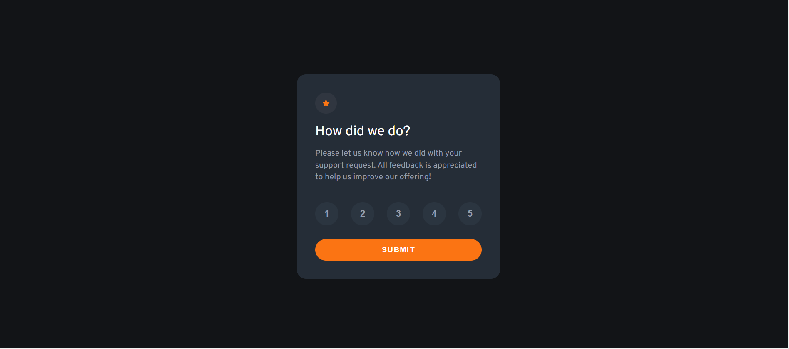
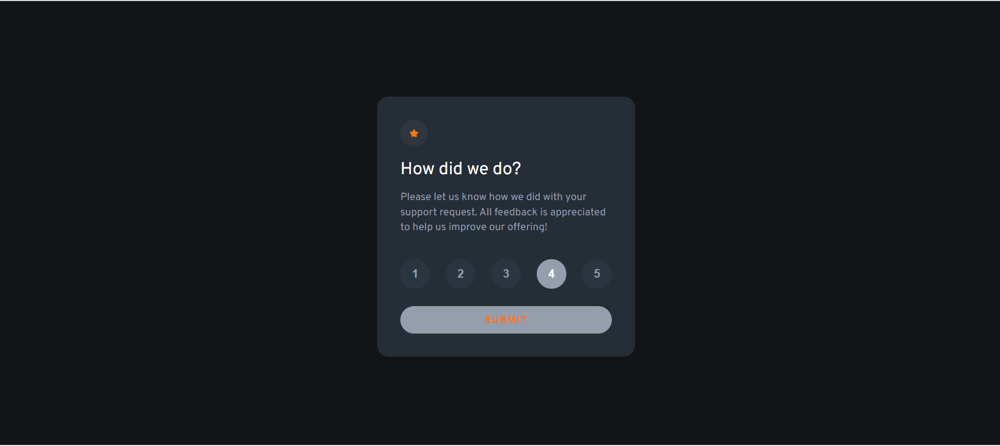
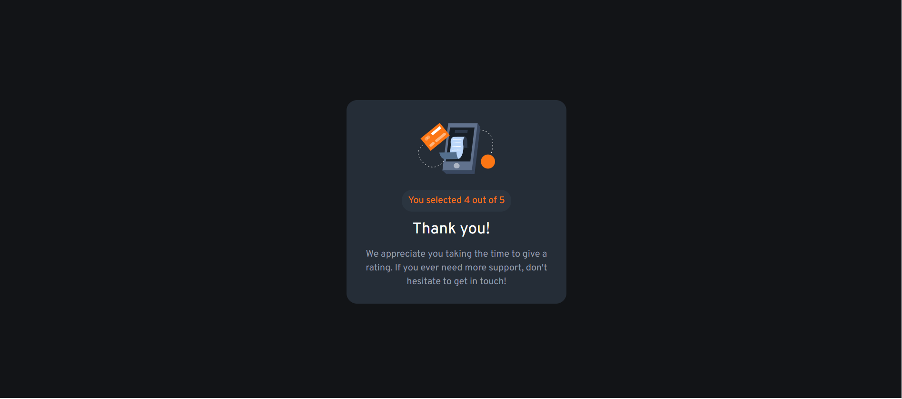

# Frontend Mentor - Interactive rating component solution

This is a solution to the [Interactive rating component challenge on Frontend Mentor](https://www.frontendmentor.io/challenges/interactive-rating-component-koxpeBUmI). Frontend Mentor challenges help you improve your coding skills by building realistic projects.

## Table of contents

- [Overview](#overview)
  - [The challenge](#the-challenge)
  - [Screenshot](#screenshot)
  - [Links](#links)
- [My process](#my-process)
  - [Built with](#built-with)
  - [What I learned](#what-i-learned)
  - [Continued development](#continued-development)
  - [Useful resources](#useful-resources)
- [Author](#author)
- [Acknowledgments](#acknowledgments)

**Note: Delete this note and update the table of contents based on what sections you keep.**

## Overview

Interactive UI component, reflexive using Flexbox and Javascript for the interactions. I'd very much appreciate any tips and ideas to make it better or in a more eficient way. Thank you!

### The challenge

Users should be able to:

- View the optimal layout for the app depending on their device's screen size
- See hover states for all interactive elements on the page
- Select and submit a number rating
- See the "Thank you" card state after submitting a rating

### Screenshots

### Links

- Solution URL: (https://www.frontendmentor.io/solutions/responsive-with-flexbox-and-javascript-HkZF1Yvmc)
- Live Site URL: (https://danilobml.github.io/FEM-interactive-rating-component/)

## My process

### Built with

- Semantic HTML5 markup
- CSS custom properties
- Flexbox
- Mobile-first workflow
- JavaScript

### What I learned

Using Javascript to show/hide parts of the UI.

### Continued development

I feel like I need a lot of practice with those UI elements (they still take me lomg time), and I appreciate tips and learning better ways of doing it.

### Useful resources

- Stackoverflow, for the event listeners.

## Author

- Website - [Danilobml](https://github.com/danilobml)
- Frontend Mentor - [@danilobml](https://www.frontendmentor.io/profile/danilobml)

## Acknowledgments

As always, I'd like to thank Ben, from WBS Coding School, not only for being a great and patient teacher, but also for insisting that I kept practicing on Frontend Mentor (which has been a great learning exercise).
